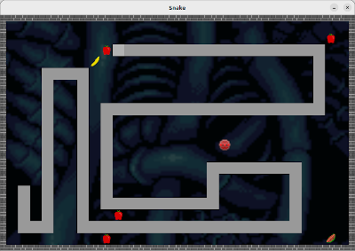

# Rust Bevy Wasm Snake Game

A little project for learning Rust, to try out Bevy and WebAssemby.

Bevy version 0.10 compatible.

The game itself is just a basic snake game.



## Native build

A simple `cargo build` is enough for the debug build.

## Webassembly build

The game can be built to WASM without any modifications.

### Installation

Install _wasm-bindgen_ with `cargo install wasm-bindgen-cli`.
Install _Trunk_ with `cargo install trunk`.

### Building

Run `cargo build --target wasm32-unknown-unknown` to compile
the WebAssembly version of the game. The release version can
be compiled the same way by adding `--release` to the command.

To test it locally, `cargo run --target wasm32-unknown-unknown`
is enough start the web server that serves it.
It has been configured in `.cargo/config.toml` that _wasm-server-runner_
is then used to run the WASM version of the game.

Build with _wasm-bindgen_ using
`wasm-bindgen --out-dir ./out/ --target web target/wasm32-unknown-unknown/release/snake.wasm`.

Trunk build can be done simply with `trunk build`.
It requires an imput `index.html` and `index.scss` files.
Those are included in the repository root.
Trunk output files go to `dist/` subdirectory.

Easy way to test it locally is to run a simple HTTP server
from the `dist/` directory with `python3 -m http.server 8000`.
Note, that to be able to access the assets, go to `dist/` and
`ln -s ../assets assets`.

## Playing the Game

Use arrow keys to control the snake.
At any point press `Escape` to exit the game.

On the WASM version you need to give it focus first (by clicking
it with the mouse).

## Issues

Dit issue tracker is used to track what needs to be done.
Dit issues are in a separate git repository.

## Focus on an element on document load

How to set focus to the WASM game when the web page is loaded?

First give and `id` to the WASM game element. The `div` or whatever it is.
Then add this script to the template. Change the element id to match.

```
window.addEventListener('load', function() {
  var input = document.getElementById('myInput');
  input.focus();
});
```

## Contributions

Snake image shown in the beginning is from
[OpenClipart-Vectors](https://pixabay.com/users/openclipart-vectors-30363/).

Living tissue background image is from
[Ansimuz](https://opengameart.org/content/living-tissue-background).
